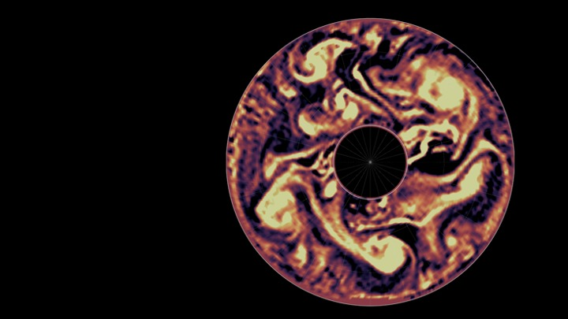

# 网页编辑说明

网站地址：https://shan3ding.github.io/  
代码仓库：https://github.com/Shan3Ding/Shan3Ding.github.io  

这是静态网页。改内容后，需要把改动推到 GitHub，大约 1 分钟后线上才会更新。

本地预览（在项目文件夹里运行）：

```bash
python3 -m http.server 8080
```

浏览器打开 http://localhost:8080

---

## 1. 改完后如何上线

1. 在 Cursor / VS Code 里保存文件。
2. 用 Git 提交并推送到 `main` 分支，例如：

```bash
git add .
git commit -m "Update publications"
git push
```

3. 打开 https://shan3ding.github.io/ 并强制刷新（Mac：`Cmd + Shift + R`）。

也可以在 GitHub 网页上直接编辑文件：打开仓库 → 点进对应文件 → 铅笔图标编辑 → Commit changes。

---

## 2. 文件放在哪里

| 要改的内容 | 文件 |
|---|---|
| 论文 | `data/publications.json` |
| 新闻 | `data/news.json` |
| 相册 | `data/gallery.json` + `assets/` 里的图片 |
| 简历条目 | `data/cv.json` |
| 主页姓名、简介、研究方向 | `index.html` |
| 主页背景图 | `assets/hero.jpeg` |
| 主页简介旁的照片 | `assets/portrait.jpg` |
| 页眉名字、邮箱、页脚文字 | `js/site.js` |
| 导航菜单 | `js/site.js` 里的 `NAV` |

编辑 JSON 时注意：

- 用英文双引号 `" "`，不要用中文引号。
- 每条记录之间用逗号，**最后一条后面不要逗号**。
- 没有链接时写 `null`，不要留空。
- 可用 [jsonlint.com](https://jsonlint.com/) 检查格式。

---

## 3. 增加 / 删除论文

编辑 `data/publications.json`。

### 增加一篇

把下面这一段复制到数组最前面（最新的放上面也可以，网页会按年份排序）：

```json
{
  "title": "Paper title here",
  "authors": "S.-S. Ding, A. Collaborator",
  "journal": "Journal of Fluid Mechanics 123, A1",
  "year": 2026,
  "topic": "geostrophic_turbulence",
  "doi": "10.1017/jfm.xxxx",
  "abstract": "One or two sentences.",
  "citation_count": 0,
  "featured": false,
  "pdf_url": null
}
```

`topic` 只能填这些值（决定 Publications 页的筛选按钮）：

| 填写值 | 页面上显示 |
|---|---|
| `rotating_convection` | Rotating Convection |
| `boundary_layers` | Boundary Layers |
| `geostrophic_turbulence` | Geostrophic Turbulence |
| `vortex_dynamics` | Vortex Dynamics |
| `atmospheric_flows` | Atmospheric Flows |
| `other` | Other |

`doi` 只填编号，不要加 `https://doi.org/`。主页会自动显示最新 4 篇。

### 删除一篇

删掉对应的整段 `{ ... }`，并检查前后逗号是否还正确。

---

## 4. 发布 / 删除新闻

编辑 `data/news.json`。

### 发布一条

```json
{
  "date": "2026-09-01",
  "title": "Short headline",
  "category": "publication",
  "content": "You can use *italic* and **bold**.",
  "link_url": "https://doi.org/10.xxxx/xxxxx",
  "pinned": false
}
```

- `date` 格式必须是 `YYYY-MM-DD`。
- `category` 常用：`publication`、`talk`、`award`、`opening`。会显示在日期旁边。
- `pinned: true` 会在 News 页显示 Pinned 标签。
- 没有外链时：`"link_url": null`。
- 主页自动显示日期最新的 3 条。

### 删除一条

删掉对应的整段 `{ ... }`。

---

## 5. 增加 / 删除 Gallery

现在 Gallery 是空的。图片请放到 `assets/gallery/`（没有这个文件夹就新建一个），然后编辑 `data/gallery.json`。

### 增加一张图

1. 把图片复制到 `assets/gallery/my-figure.jpg`。
2. 在 `gallery.json` 里加入：

```json
[
  {
    "title": "Zonal jets in the rotating annulus",
    "media_type": "image",
    "file_url": "../assets/gallery/my-figure.jpg"
  }
]
```

### 增加一段动画 / 视频

把 `.mp4` 放到 `assets/gallery/`，然后：

```json
{
  "title": "Vortex motion",
  "media_type": "animation",
  "file_url": "../assets/gallery/vortex.mp4"
}
```

`media_type` 只能是 `image` 或 `animation`。

### 删除

同时删掉 `gallery.json` 里的条目，以及 `assets/gallery/` 里对应的文件。

---

## 6. 更换主页背景图

1. 准备一张尽量大的横图（建议宽度 2000 像素以上）。
2. 用新图覆盖 `assets/hero.jpeg`（文件名保持 `hero.jpeg` 最省事）。
3. 如果新图是 `.png` 或 `.jpg`，覆盖后把 `index.html` 里这一行改成新文件名：

```html

```

图片会自动铺满顶部并裁切；底部有一层深色渐变，方便看清白色名字。

主页简介旁的圆形照片是 `assets/portrait.jpg`。用同名文件覆盖即可更换。若改文件名，同步改 `index.html` 里 `hero-portrait` 的 `src`。

---

## 7. 修改主页基本信息

打开 `index.html`，直接改文字：

| 页面上看到的 | 在文件里搜 |
|---|---|
| 大标题姓名 | `Shan-Shan Ding`（`<h1>` 那一行） |
| 研究方向关键词 | `Fluid Dynamics · Geophysical Turbulence · Atmospheric Flows` |
| 简介 | `Postdoctoral Research Associate, studying...` |
| 单位 | `University of Oxford` |
| 当前课题 | `Thermal effect in geophysical turbulence` |
| 浏览器标签标题 | `<title>ScholarsArchive</title>` |

页眉左上角的短名 `S.-S. Ding`、页脚邮箱、页脚欢迎语在 `js/site.js` 里，搜：

- `S.-S. Ding`
- `shanshan.ding@physics.ox.ac.uk`
- `Let's Collaborate`

改邮箱时，`mailto:` 后面的地址和显示出来的文字都要改。

---

## 8. 添加 / 修改个人信息（简历）

编辑 `data/cv.json`。每一条是一段经历：

```json
{
  "title": "Postdoctoral Research Associate",
  "institution": "University of Oxford",
  "start_year": 2023,
  "end_year": null,
  "category": "position",
  "description": "One or two sentences about what you did."
}
```

- 仍在进行中：`"end_year": null`，页面会显示 `2023–Present`。
- 已结束：`"end_year": 2025`。
- `category` 只能填：

| 填写值 | 页面筛选 |
|---|---|
| `education` | Education |
| `position` | Positions |
| `grant` | Grants |
| `award` | Awards |
| `service` | Service |

条目按 `start_year` 从新到旧排列。

---

## 9. 增加新模块（例如招聘信息）

有两种做法。招聘信息建议用 **A**，改动最少。

### 做法 A：加在主页（推荐）

在 `index.html` 里，找到 `Latest News` 那一段 `</section>` 后面，插入：

```html
<section class="section">
  <div class="section-grid">
    <div class="section-label">
      <span>Openings</span>
      <div class="theorem-line"></div>
    </div>
    <div class="section-main">
      <h3 class="font-serif" style="font-size:1.5rem;margin:0 0 0.75rem">PhD / Postdoc positions</h3>
      <p class="text-body" style="color:hsl(var(--muted-foreground));max-width:42rem">
        I am looking for students and postdocs interested in geostrophic turbulence
        and laboratory experiments. Please email
        <a class="link-more" href="mailto:shanshan.ding@physics.ox.ac.uk">shanshan.ding@physics.ox.ac.uk</a>
        with a CV.
      </p>
    </div>
  </div>
</section>
```

把段落改成你的招聘正文即可。不想展示时，删掉这一整段 `<section>...</section>`。

如果希望招聘条目也能像新闻一样增删，可以新建 `data/openings.json`，再在 `js/site.js` 里仿照 `renderNews()` 写一个读取函数。需要的话可以让我来加。

### 做法 B：做成独立页面（Openings）

1. 新建文件夹 `openings/index.html`（可复制 `news/index.html` 再改标题）。
2. 在 `js/site.js` 顶部的 `NAV` 数组里加一项，例如：

```js
{ label: "VI.", title: "Openings", path: "/openings/" }
```

3. 同一文件里，页脚 Site Map 再加一个链接。
4. 在 `currentPath()` 里加上对 `/openings` 的判断。

导航罗马数字 `I.` `II.` `III.` 请按实际顺序改。

---

## 10. 常见问题

**改了但网站没变**  
多半是还没 `git push`，或浏览器缓存。用 `Cmd + Shift + R` 强制刷新。

**页面空白 / 论文列表消失**  
通常是 JSON 少了引号或多了逗号。用 jsonlint 检查对应的 `data/*.json`。

**图片不显示**  
检查文件名大小写是否和 JSON / HTML 里完全一致，以及路径是否以 `assets/` 或 `../assets/` 开头。

**只想改一处、怕改坏**  
在 GitHub 网页上改文件最安全：改错了可以在仓库的 History 里点 Revert。
